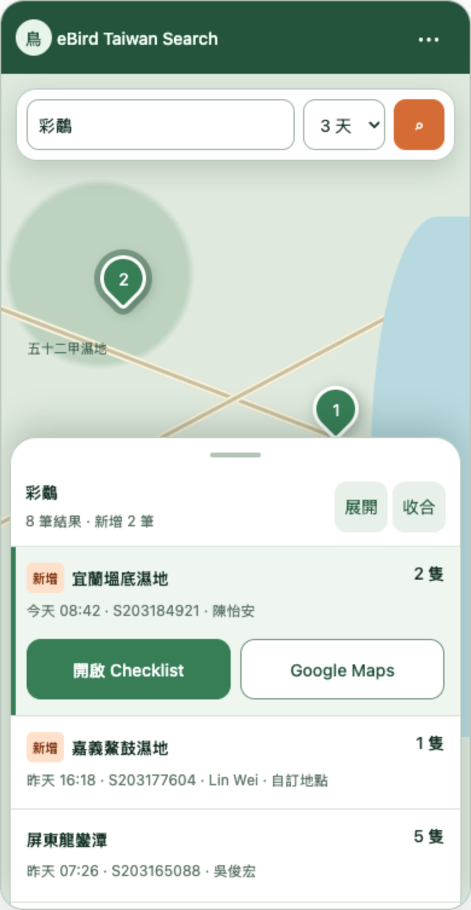
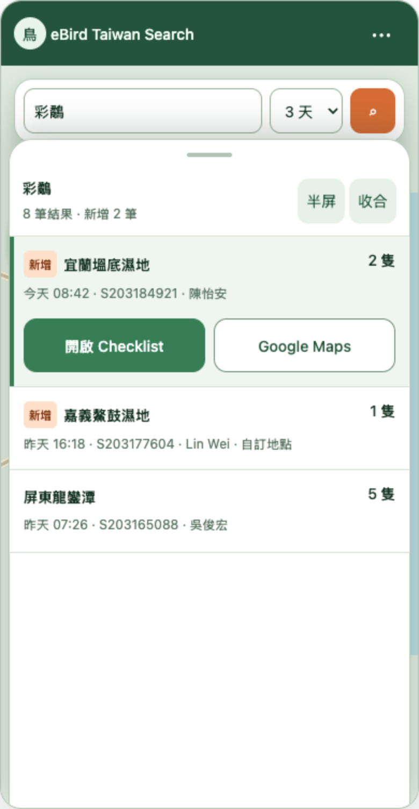
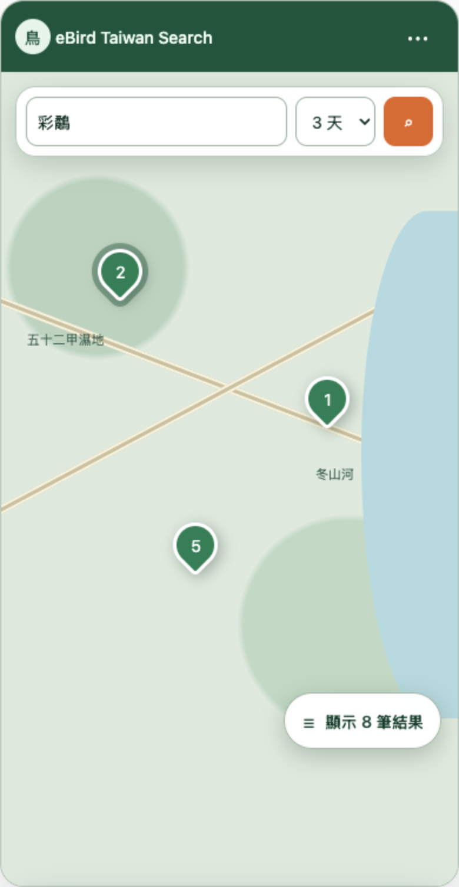

# Search App 手機 Bottom Sheet 流程參考

這組畫面保存 Search App 手機版的資訊層級與操作動線，供實作與 review 對照。互動行為以 [Cloudflare Search App 架構計劃](../cloudflare-search-app-plan.md#responsive-layout) 為準；畫面中的色彩、字型、間距、地圖細節與元件外觀不是像素規格。

## 半屏清單與選取項目

搜尋結果預設以半屏清單顯示。被選取的紀錄保留原有資訊，並在同一項目內顯示 Checklist 與 Google Maps 主要操作。

## 近全屏清單

使用者可以上拉清單，讓結果與主要操作使用接近完整螢幕的空間；清單與半屏狀態使用同一份結果與選取狀態。

## 完全收合與重新開啟

清單完全收合後，地圖側邊保留 `顯示 N 筆結果` 文字按鈕。按鈕會以半屏重新開啟完整清單；點選任何 Pin 也會開啟清單並選取對應紀錄。

